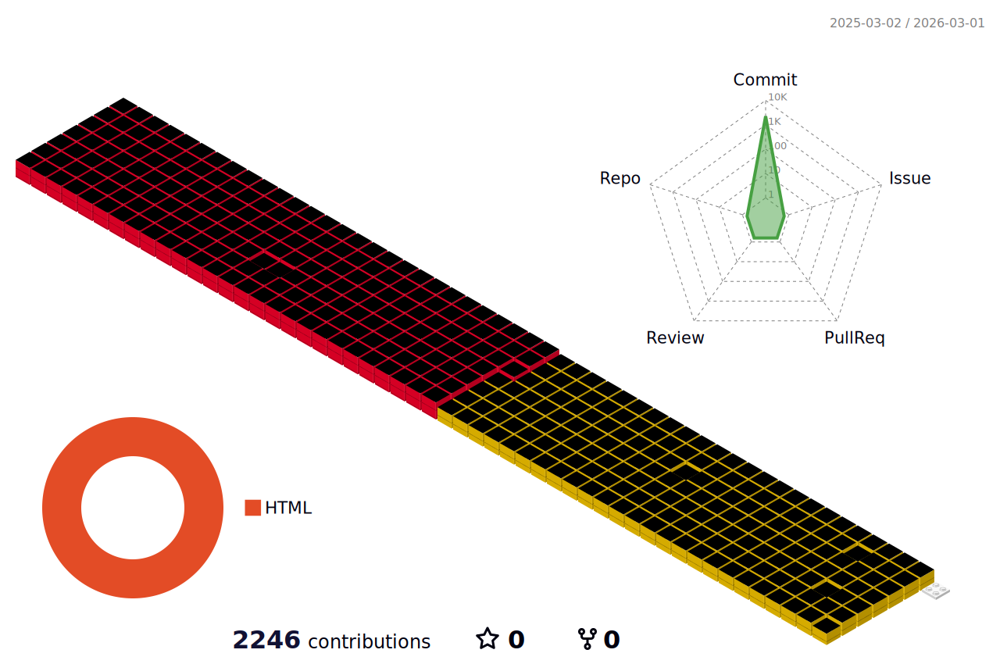

<!--header 부분-->

<!--내용 부분-->
## 💬 Chat 💬

## ✨ Tech Stack ✨

 

 

## 📚 Studying 📚

## 🛠 Tools 🛠

## 📫 Contact 📫
<a href="https://velog.io/@oka1313">
&nbsp
</a>
<a href="mailto:oka1313@gmail.com">
&nbsp
</a>

## 🌸 Contributions 🌸
### 📊 3D Chart 📊

<!-- 
    # 3D Chart 종류
    profile-3d-contrib/profile-green-animate.svg
    profile-3d-contrib/profile-green.svg
    profile-3d-contrib/profile-season-animate.svg
    profile-3d-contrib/profile-season.svg
    profile-3d-contrib/profile-south-season-animate.svg
    profile-3d-contrib/profile-south-season.svg
    profile-3d-contrib/profile-night-view.svg
    profile-3d-contrib/profile-night-green.svg
    profile-3d-contrib/profile-night-rainbow.svg
    profile-3d-contrib/profile-gitblock.svg
-->

<!--snake🐍-->
### 🐍 Snake 🐍

<!--
**K-T-J/K-T-J** is a ✨ _special_ ✨ repository because its `README.md` (this file) appears on your GitHub profile.

Here are some ideas to get you started:

- 🔭 I’m currently working on ...
- 🌱 I’m currently learning ...
- 👯 I’m looking to collaborate on ...
- 🤔 I’m looking for help with ...
- 💬 Ask me about ...
- 📫 How to reach me: ...
- 😄 Pronouns: ...
- ⚡ Fun fact: ...
-->
